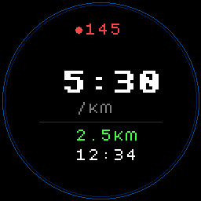
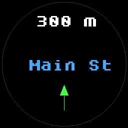
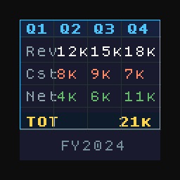
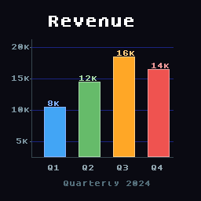
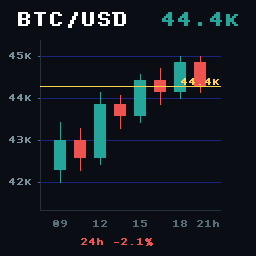
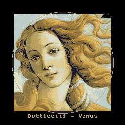

# Halo Graphic Engine

**Hardware-bounded, agent-driven interfaces for Brilliant Labs Halo smart glasses.**

Halo is an open-source pair of smart glasses with an integrated near-eye color display, camera, microphones, bone-conduction speakers, motion sensors, a low-power processor, and Bluetooth LE connectivity. Its 0.2-inch OLEDoS display is mounted in the frame and optically presented in the wearer’s peripheral view.

> **Status:** research prototype. Stock-firmware compatibility is the baseline. Physical-Halo validation and Android device testing remain outstanding.

## Problem

Building a non-trivial Halo interface requires coordinating several layers:

- An agent needs a structured way to describe a visual scene.
- Halo runs a constrained Lua 5.4 environment rather than a conventional UI toolkit.
- The integrated color display exposes a 256×256 drawable area with immediate drawing and limited primitives.
- Large images cannot safely be embedded as escaped Lua source.
- BLE has negotiated MTU limits, message framing, and receiver-paced acknowledgements.
- A phone host must package resources and update the display without exceeding device limits.

Generating a large Lua script for every frame couples visual intent to transport details and can produce code that works in a desktop emulator but fails on the physical device.

## Approach

The engine separates **what to draw** from **how Halo receives it**:

```text
Agent or application
        │
        ▼
Halo Scene Description (HSD), a JSON scene graph
        │
        ├── small scene ──► bounded Lua REPL command
        │
        └── assets/frames ─► Halo Render Protocol (HRP)
                              │
                              ▼
                 official BLE message framing
                              │
                              ▼
                    Halo Lua runtime and APIs
```

HSD uses familiar scene-graph concepts: text, shapes, groups, rows, columns, and sprites. The compiler handles coordinate conversion, colors, font constraints, indexed sprite packing, resource IDs, and size validation.

HRP is a compact binary protocol carried inside the official Brilliant data-message framing. It reduces Lua source and parsing overhead while using existing `frame.display.*` APIs. It does not claim to add alpha blending, rotation, layers, double buffering, or other capabilities absent from stock firmware.

## Why Python, Kotlin, and Lua?

- **Python** is the reference implementation for rapid protocol work, image quantization, agent/MCP integration, and emulator validation.
- **Kotlin** is the intended production host for an Android phone and mirrors the compiler and HRP byte layout.
- **Lua** runs on the glasses and is kept small because it executes inside Halo’s embedded runtime.

Python and Kotlin are expected to produce equivalent HSD/HRP behavior. Python provides reference vectors and hardware-free tests; Kotlin provides the Android integration path.

## Hardware-first principles

1. Stock Halo behavior is the compatibility boundary.
2. Conservative limits are applied before transmission; the emulator does not justify larger hardware payloads.
3. Binary assets use the data channel instead of escaped Lua literals.
4. Immediate drawing is handled explicitly because Halo has no hardware layers or double-buffered `show()` model.
5. Protocol limits and engine safety budgets are kept distinct from measurements that must be obtained on physical hardware.

## Quick start

Install the Python reference package:

```bash
python -m pip install -e ./python
```

Compile a small scene to Lua and preview it:

```bash
python -m halo_engine.compile scenes/running_hud.json --out /tmp/running_hud.lua
python -m halo_engine.preview /tmp/running_hud.lua --out /tmp/running_hud.png
```

Compile a hardware-bounded binary HRP frame:

```bash
python -m halo_engine.hrp_compile scenes/venus_image.json --out /tmp/venus.hrp
```

Run tests:

```bash
python -m pytest python/tests -q
gradle :kotlin:test
gradle :kotlin:build
```

The Android library target requires an Android SDK. Once configured, run:

```bash
gradle :android:assembleDebug
gradle :android:connectedDebugAndroidTest
```

## Examples

Source-controlled scene descriptions are in [`scenes/`](scenes/):

| Scene | Demonstrates | Recommended mode |
|---|---|---|
| [`running_hud.json`](scenes/running_hud.json) | Metrics and compact text layout | Lua or HRP |
| [`navigation_hud.json`](scenes/navigation_hud.json) | Directional primitive graphics | Lua or HRP |
| [`results_table.json`](scenes/results_table.json) | Excel-like grid and results | Lua or HRP |
| [`bar_chart.json`](scenes/bar_chart.json) | Axes, labels, and bars | Lua or HRP |
| [`btc_chart.json`](scenes/btc_chart.json) | Candlesticks and price overlay | Lua or HRP |
| [`icon_test.json`](scenes/icon_test.json) | Indexed sprite rendering | HRP |
| [`venus_image.json`](scenes/venus_image.json) | 16-color indexed image | HRP |

### Rendered previews

These previews were generated by the same hardware-bounded HRP runtime used in the validation process. They show the 256×256 Halo drawable area and are included to make the scene language immediately understandable.

| Running HUD | Navigation HUD |
|---|---|
|  |  |

| Results table | Bar chart |
|---|---|
|  |  |

| BTC day chart | Icon test |
|---|---|
|  |  |

| Venus image |
|---|
|  |

The Venus source image is a Wikimedia Commons image used as a public-domain image-processing example: [source metadata](https://commons.wikimedia.org/wiki/File:Venus_botticelli_detail.jpg).

## Repository structure

```text
scenes/                 HSD examples and image assets
python/halo_engine/     Python compiler, HRP, sprites, MCP, atlas, and diffs
python/tests/            Python and emulator tests
kotlin/                 Kotlin/JVM compiler and host abstractions
android/                Android library and BluetoothGatt transport
lua/                    Device-side HRP runtime
```

## Scope and limitations

The current implementation targets Halo’s existing primitives: text, pixels, lines, rectangles, circles, polygons, indexed bitmaps, palette handling, and immediate drawing. It does not provide alpha blending, rotation, GPU layers, arbitrary polygon filling, or double buffering on stock firmware.

The project uses conservative safety budgets because exact usable memory and throughput depend on firmware configuration and workload. Emulator success is not a substitute for physical-device measurements.

## References

- [Brilliant Labs Halo](https://brilliant.xyz/products/halo)
- [Halo Hardware Manual](https://docs.brilliant.xyz/halo/hardware/)
- [Brilliant SDK](https://github.com/brilliantLabsAR/brilliant_sdk)
- [Halo Lua documentation](https://docs.brilliant.xyz/halo/halo-sdk-lua/)
- [Halo Bluetooth specifications](https://docs.brilliant.xyz/halo/halo-sdk-bluetooth-specs/)

## License

MIT. This is an independent research project and is not affiliated with Brilliant Labs or Garmin.
